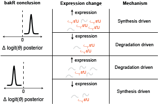

---

```{r, include = FALSE}
knitr::opts_chunk$set(
  collapse = TRUE,
  comment = "#>",
  fig.dim = c(6, 4)
)
```


## Introduction

These are the packages you are going to have to install and load in order to do everything presented in this vignette:

```{r setup}
library(bakR)

# Packages that are NOT automatically installed when bakR is installed
library(DESeq2)
library(pheatmap)

# Packages which are installed when bakR is installed
library(dplyr) 
library(magrittr) 
library(ggplot2) 
library(stats)

# Set the seed for reproducibility
set.seed(123)
```

## Key takeaways from this vignette

The discussion of `DissectMechanism` presented here is a bit involved. Thus, I would like to start with a brief summary of what I hope you understand about the use of `DissectMechanism` and the caveats of its analysis strategy:

1. `DissectMechanism`'s analysis strategy is "quasi-steady-state-independent". More specifically, it assumes that at least one of the population of cells you are comparing is at steady-state. The other population can be far away from steady-state, but things get much more complicated if both populations being compared are dynamically regulating their RNA levels during the experiment.
1. You have to be weary of the risk of false positives when using `DissectMechanism`. The `bakR_cutoff` parameter in `DissectMechanism` determines which type of false positive (false transcriptional regulation or false post-transcriptional regulation) is more likely.
    * `bakR_cutoff` closer to 1 (it's maximum value; setting it to a higher number is identical to setting it to 1) will yield more post-transcriptional false positives.
    * Lower `bakR_cutoff` values will yield more transcriptional false positives.
    * Why this is the case is discussed at the end of this vignette in great detail.
1. Choose `bakR_cutoff` based on which type of false positive will impact you less.
    * Are you looking for high confidence instances of post-transcriptional regulation? A `bakR_cutoff` of 0.05 or lower is a good choice for you to avoid post-transcriptional false positives. 
    *Are you looking for high confidence instances of transcriptional regulation? Increasing `bakR_cutoff` to 0.5 or higher is probably a good idea. 
    *Are you equally happy to flag either type of regulation? `bakR_cutoff`'s default value of 0.3 should work well.
1. `DissectMechanism` was not part of the original bakR publication. I developed the analysis strategy in collaboration with a previous undergraduate in the Simon lab (Matthew Saenz) a while back, but only recently implemented a modified version of our original idea in bakR. Thus, if you have any questions after reading this vignette, the best course of action is to post it to the Issues page of the bakR Github or email me directly (at isaac.vock@yale.edu) since there is no other public material on this topic.
1. If you are analyzing non-steady-state data, `DissectMechanism` will work best if the label times (length of time cells were metabolically labeled for) are the same in the datasets being compared. `DissectMechanism` does what it can to normalize out label time differences, but this strategy is only 100% rigorous in the steady-state case.

## Mechanistic dissections of gene expression regulation with bakR + DESeq2

The goal of the `DissectMechanism` function discussed in this vignette is to identify the **major** kinetic mechanism of any differential expression observed. The analysis strategy is as follows:

1. Compare NR-seq with bakR
1. Perform differential expression analysis
1. Use the DissectMechanism() function in bakR to combine the results and come to a mechanistic conclusion.

Simple enough! As usual, let's start out by simulating some data. I will simulate two separate datasets, one with exclusively transcriptional regulation and one with exclusively post-transcriptional regulation. This will allow us to see how `DissectMechanism` performs in these two different regimes:

```{r}

### Only differential synthesis

# Simulate a nucleotide recoding dataset
sim_data <- Simulate_relative_bakRData(1000, 1000000,
                         num_ks_DE = c(0, 300),
                         num_kd_DE = c(0, 0))
  # This will simulate 1000 features, 1 million reads, 2 experimental conditions
  # and 3 replicates for each experimental condition. 300 features will be differentially
  # transcribed, and there will be no differential stability
  # See ?Simulate_bakRData for details regarding tunable parameters

# Extract simulated bakRData object
bakRData <- sim_data$bakRData

## Run the efficient model
Fit_s <- bakRFit(bakRData)


### Only differential stability

# Simulate a nucleotide recoding dataset
sim_data <- Simulate_relative_bakRData(1000, 1000000,
                         num_ks_DE = c(0, 0),
                         num_kd_DE = c(0, 300))
  # This will simulate 1000 features, 1 million reads, 2 experimental conditions
  # and 3 replicates for each experimental condition. 300 features will be differentially
  # transcribed, and there will be no differential stability
  # See ?Simulate_bakRData for details regarding tunable parameters

# Extract simulated bakRData object
bakRData <- sim_data$bakRData

## Run the efficient model
Fit_d <- bakRFit(bakRData)

```

Next, we can perform differential expression analysis just as described in the differential synthesis analysis vignette:

```{r}

### Only differential synthesis dataset

# Get the count matrix from bakR
Counts <- Fit_s$Data_lists$Count_Matrix

# Experimental conditions for each sample
# There are 6 s4U treated samples (3 replicates of each condition)
# In addition, there are 2 -s4U control samples (1 for each condition)

## s4U conditions
# 1st three samples are reference (ref) samples
# Next three samples are experimental (exp) samples
conditions_s4U <- as.factor(rep(c("ref", "exp"), each = 3))

## -s4U control conditions
# 1st sample is reference, next is experimental
conditions_ctl <- as.factor(c("ref", "exp"))

# Combined s4U and -s4U control conditions
conditions <- c(conditions_s4U, conditions_ctl)

# Make the colData input for DESeq2
colData <- data.frame(conditions = conditions)
rownames(colData) <- colnames(Counts)

# Make DESeq2 data object
dds_s <- DESeqDataSetFromMatrix(countData = Counts,
                              colData = colData,
                              design = ~conditions)

# Fit DESeq2 model
ddso_s <- DESeq(dds_s)

# Extract results of experimental vs. reference comparison
reso_s <- results(ddso_s, contrast = c("conditions", "exp", "ref"))


### Only differential stability dataset

# Get the other count matrix from bakR
Counts <- Fit_d$Data_lists$Count_Matrix

# Make DESeq2 data object
dds_d <- DESeqDataSetFromMatrix(countData = Counts,
                              colData = colData,
                              design = ~conditions)

# Fit DESeq2 model
ddso_d <- DESeq(dds_d)

# Extract results of experimental vs. reference comparison
reso_d <- results(ddso_d, contrast = c("conditions", "exp", "ref"))


```

We're almost ready to use bakR's special DissectMechanism() function. DissectMechanism() has two required inputs:

1. A bakR fit object
1. A data frame containing differential expression analysis results

In particular, the differential expression data frame must contain five columns named as follows:

1. **XF**: Name of the feature (gene, exon, etc.) that the read comes from.
1. **L2FC_RNA**: L2FC(RNA) estimated by the differential expression analysis.
1. **DE_score**: L2FC(RNA)/se[L2FC(RNA)]; so like a differential expression z-score.
1. **DE_pval**: P-value from differential expression analysis.
1. **DE_padj**: Multiple test adjusted p-value from differential expression analysis.

Conveniently, our DESeq2 results object has all the information we need! We can make the differential expression data frame like so:

```{r, results = 'hide'}

### Only differential synthesis: 

# Convert to data frame
reso_s <- as.data.frame(reso_s)

# Make data frame
DE_df_s <- data.frame(XF = row.names(reso_s),
                    L2FC_RNA = reso_s$log2FoldChange,
                    DE_score = reso_s$stat,
                    DE_pval = reso_s$pval,
                    DE_padj = reso_s$padj)


### Only differential degradation:

# Convert to data frame
reso_d <- as.data.frame(reso_d)

# Make data frame
DE_df_d <- data.frame(XF = row.names(reso_d),
                    L2FC_RNA = reso_d$log2FoldChange,
                    DE_score = reso_d$stat,
                    DE_pval = reso_d$pval,
                    DE_padj = reso_d$padj)


```

We are ready to perform a mechanistic dissection now!

```{r, results = 'hide'}

# Decreasing sims parameter to speed up; wouldn't normally suggest this if you
# want higher precision mechanism p-values, discussed later
Mechs_s <- DissectMechanism(Fit_s, DE_df_s,
                          sims = 1000000)

Mechs_d <- DissectMechanism(Fit_d, DE_df_d,
                          sims = 1000000)

```

See ?DissectMechanism for information about the additional parameters that can be specified. Most importantly, there is the bakRModel parameter, which tells DissectMechanism which fit to use in the bakRFit model, if multiple exist. The default setting is to just use the MLE fit, which should always be there. 

So what is in the output of DissectMechanism? Two data frames:

1. Heatmap_df: A data frame meant to facilitate visualization of results as a heatmap.
1. Mechanism_df: A data frame with statistical assessments of likely mechanisms of observed differential expression.

Heatmap_df has the three following columns:

1. **bakR_score**: The logit(fraction new) change z-score from bakR
1. **DE_score**: The L2FC(RNA) z-score from DESeq2
1. **Mech_score**: A mechanism z-score that quantifies the extent to which significant changes in gene expression are synthesis or degradation driven. Synthesis driven = positive numbers; degradation driven = negative numbers.

You can quickly make the heatmap using the lovely pheatmap package:

```{r, fig.align='center'}

# Nice red to blue color gradient
  # Feel free to use any coloring your heart desires
col <- c("#053061", "#2166AC", "#4393C3", "#92C5DE", 
         "#D1E5F0", "#F7F7F7", "#FDDBC7", "#F4A582", 
         "#D6604D", "#B2182B", "#67001F")

# Heatmap for differential synthesis only dataset
pheatmap(Mechs_s$Heatmap_df, cluster_cols = FALSE, show_rownames = FALSE, color = col)

# Heatmap for differential degradation only dataset
pheatmap(Mechs_d$Heatmap_df, cluster_cols = FALSE, show_rownames = FALSE, color = col)

```

Each row in the data frame output by DissectMechanism corresponds to a feature that was differentially expressed in the experimental condition. Differential expression is defined as a `DE_padj` less than the `DE_cutoff` parameter in `DissectMechanism`. These are the features with the highest confidence observed regulation, and thus the ones you are most likely to be interested in assessing the mechanism of regulation.

Mechanism_df provides all of the information present in Heatmap_df, and then some, for all features, even those that are not "significantly differentially expressed". The columns of Mechanism_df are as follows:

1. **XF**: Feature name
1. **bakR_score**: bakR z-score for kdeg difference
1. **L2FC_kdeg**: L2FC(kdeg) estimated by bakR
1. **bakR_pval**: P-value of L2FC(kdeg) estimated by bakR
1. **bakR_padj**: bakR's multiple test adjusted p value
1. **L2FC_RNA**: L2FC([RNA]) estimated by a differential expression analysis (DEA) tool
1. **DE_score**: L2FC([RNA]) z-score from DEA tool
1. **DE_pval**: P-value for differential expression
1. **DE_padj**: Multiple test adjusted p-value for differential expression
1. **mech_stat**: Mechansism assignment test statistic
1. **mech_pval**: P-value for mechanism assignment
1. **mech_padj**: Multiple test adjusted p-value for mechanism assignment
1. **meta_pval**: P-value that either bakR or DEA z-score is non-null (i.e., a bakR + DEA meta analysis p-value)
1. **meta_padj**: Multiple test adjusted meta analysis p-value
1. **L2FC_ksyn**: L2FC(ksyn) estimated as discussed in the differential synthesis analysis vignette.
1. **ksyn_score**: L2FC(ksyn) z-score estimated as discusssed in the differential synthesis analysis vignette.
1. **ksyn_pval**: L2FC(ksyn) p-value estimated as discussed in the differential synthesis analysis vignette.
1. **ksyn_padj**: Multiple test adjusted L2FC(ksyn) p-value.

The first nine columns are things you provided to `DissectMechanism`. The next five columns are the important output of `DissectMechanism`'s statistical analysis. This analysis really consists of two separate analyses:

1. Mechanistic analysis: Assessing whether or not there is evidence for transcriptionally or post-transcriptionally driven gene expression regulation.
    * As discussed above, positive values for **mech_stat** represent transcriptional (i.e., synthesis-driven) regulation. Negative values represent post-transcriptional (i.e., stability-driven) regulation. 
1. Meta-analysis: Assessing whether or not there is evidence for any of: differential expression, differential kinetics (bakR output), or both.
    * For this, Fisher's method is used to combine the DEA and bakR p-values and assess the probability of obtaining a duo of p-values like this if both the differential expression and differential fraction new signal were null.
    
The final 4 columns are the output of differential synthesis analysis conducted as described in the vignette on this topic. For details, check out that vignette.
    
One thing I like to look at is how the combination of the estimated L2FC(RNA) and L2FC(kdeg) give rise to the mechanism statistic. Let's look at the dataset with exclusively transcriptional regulation:

```{r, fig.align='center'}

# Scatter plot of L2FC(kdeg) vs. L2FC(RNA) colored by mechanism test stat
  # Gotta transform the mech_stat because it spans many orders of magnitude
ggplot(Mechs_s$Mechanism_df, aes(x = L2FC_kdeg, y = L2FC_RNA, color = log10(abs(mech_stat) + 1)*sign(mech_stat))) +
  geom_point() + 
  theme_classic() + 
  scale_color_viridis_c() + 
  xlab("L2FC(kdeg) from bakR") + 
  ylab("L2FC(RNA) from DESeq2") +
  labs(color = "Mechanism")

```

and next for the dataset with exclusively post-transcriptional regulation

```{r, fig.align='center'}

# Scatter plot of L2FC(kdeg) vs. L2FC(RNA) colored by mechanism test stat
  # Gotta transform the mech_stat because it spans many orders of magnitude
ggplot(Mechs_d$Mechanism_df, aes(x = L2FC_kdeg, y = L2FC_RNA, color = log10(abs(mech_stat) + 1)*sign(mech_stat))) +
  geom_point() + 
  theme_classic() + 
  scale_color_viridis_c() + 
  xlab("L2FC(kdeg) from bakR") + 
  ylab("L2FC(RNA) from DESeq2") +
  labs(color = "Mechanism")

```

If you take a closer look at the heatmap and scatter plot, a couple things might stick out:

1. In the case of all differential expression being driven by transcriptional regulation, there were no false positives. `DissectMechanism` correctly classified all instances of differential expression as transcriptionally driven.
1. In the case of all differential expression being driven by RNA stability regulation, there were a patch of false positives (features identified as transcriptionally regulated). Still, `DissectMechanism` did a decent job, though I will have more to say about the challenges of this analysis in the next section.
1. Higher L2FC(RNA) and L2FC(kdeg) yields higher mechanism scores, but it is possible to have a high, positive mechanism score in the absence of a large L2FC(kdeg). The scoring function will be discussed in more detail in the next section, so check that out if you are interested.


## Going beyond the steady-state assumption

You may have noticed an assumption that continually crops up in the analyses presented 
in bakR vignettes: steady-state. In the Getting-Started vignette, it was a necessary part
of relating the fraction new to the more interesting $kdeg$. In the differential synthesis analysis vignette it was a key part of assessing synthesis kinetics. It therefore underlies all of the differential kinetic analysis discussed so far. What happens if it is a bad assumption? "Dogs and cats living together! Mass hysteria!"? Well Dr. Venkman, it certainly complicates things, but `DissectMechanism` does its best to curtail these issues. 

In this section, I will discuss many of the nitty-gritty details about how `DissectMechanism` is working. It's analysis strategy is heavily inspired by the task of assessing the kinetic mechanisms of observed differential expression in a steady-state-independent manner. Accomplishing this means generalizing how differences in the fraction new in an NR-seq experiment can relate to differences in degradation **or** synthesis when away from steady-state.

### Violating the steady-state assumption
Before we talk about what to do when the steady-state assumption is questionable, it's worth
briefly mentioning *when* the steady-state assumption is worth throwing out. Assuming steady-state
RNA dynamics means that you are assuming the rate at which RNA synthesized is the same
as the rate at which it is degraded. "Wait, does that mean we are assuming $ksyn = kdeg$?" No. The
degradation rate constant $kdeg$ is not the rate of degradation. The rate of degradation (i.e., the
number of RNA molecules degraded per unit time) depends on $kdeg$ AND the amount of RNA present.
So steady-state actually means that $ksyn = kdeg*[RNA]$. In the context of NR-seq experiments, assuming
steady-state means that we are assuming this relationship holds throughout the entire metabolic label feed
time. Therefore, another way to phrase this assumption is to say that we are assuming that our population
of cells aren't actively responding to some stimulus and regulating $ksyn$ and/or $kdeg$. RNA levels remain constant during the experiment. 

Here's a fun question: are cells ever at steady-state? Yes and no. An individual cell is almost never at steady-state.
Gene expression is constantly regulated as the cell progresses through the cell cycle and performs all 
of the biochemical functions necessary to stay alive. BUT, bakR is designed to analyze *bulk* nucleotide recoding RNA-seq data. This means the data comes from a population of cells, not a single cell. Thus, when I say that I am assuming steady-state, what I really mean is that I am assuming the population average is at steady-state. If the population of cells are asynchronous (so they aren't all going through the exact same cell cycle stages at the
same time) and haven't been perturbed recently (e.g., treated with a drug), then this is probably a pretty solid assumption. 

Lots of cool experiments are done with cells far from steady-state though. When using nucleotide recoding RNA-seq, it is increasingly popular to perform rapid degradation of a protein of interest, treatment with a specific drug, or some other acute perturbation leading up to and during metabolic labeling. Therefore, we need a way to analyze data without the helpful steady-state assumption. This is challenging though, because if we can't assume steady-state, how do we relate what we measure (the fraction new) to the RNA metabolic kinetics we care about? The answer: keep it non-parametric. 

### Analyzing NR-seq data far from steady-state
I am using the term non-parametric here to suggest getting away from using explicit mathematical functions to model RNA metabolism. Rather, we can think very generally about what effects changes in RNA synthesis and degradation kinetics can have on the fraction new in an NR-seq experiment. Let's say we compare an unperturbed, steady-state population of cells to a cells that have been treated with a drug of interest. If the fraction new for a particular transcript is higher in the drug treated cells than the untreated cells, how could that have come about? Well, generally speaking, there are two possibilities:

1. The RNA may have been destabilized by the drug treatment. This is the same explanation you would give for the change if everything were steady-state.
1. The synthesis rate of the RNA may have been ramped up following drug treatment. This is an intuitive explanation that is surprisingly only possible away from steady-state. At steady-state, changes in synthesis kinetics affect the amount of new and old RNA equally, leading to no change in the fraction new.  

Here is the key realization: these two possibilities have different impacts on the LEVELS of RNA. If synthesis is
increasing upon drug treatment, then the amount of that transcript will also increase. If the transcript is 
destabilized though, then there will be less of it around at the end of the experiment. Therefore, **combining differential expression with differential fraction new analyses reveals the kinetic differences**. More generally,
here is a diagram that covers the range of possible kinetic mechanisms and conclusions:




### The statistics of DissectMechanism

`DissectMechanism` attempts to formalize the analysis discussed in the last section. It combines a differential fraction new test statistic with a differential expression test statistic. The differential fraction new test statistic is just the L2FC(kdeg) z-score output by bakR. Isn't this invalidated by violations of the steady-state assumption? Yes and no. While it is true that bakR's estimated L2FC(kdeg) may no longer truly represent the change in the degradation rate constant, it still does represent an accurate assessment of the change in the fraction new. The kdeg is estimated as:

$$
k_{\text{deg}} = -\text{ln}(1 - fn)/\text{tl}
$$
where tl is the label time. While the transformation on the right of this expression may no longer represent the degradation rate constant away from steady-state, it is simply a monotonic transformation of the fraction new. Thus, differences in bakR's estimated "kdeg" can still be interpreted as differences in the fraction new, assuming the label times in the conditions being compared are the same. If the label times differ, this also represents a naive (though somewhat inaccurate in the non-steady-state case) normalization for these differences.

The mechanism test statistic used by `DissectMechanism` is quite simple. It's just:

$$
\text{mech_stat} = [\text{L2FC(kdeg) z-score}]*[\text{L2FC(RNA) z-score}]
$$

Why this is a reasonable test-statistic choice is best demonstrated via visualization of this function:

```{r, fig.align='center'}

## Grid to plot on

# Grid size in each axis
n <- 300

# DE z-scores
DE_score <- rep(seq(from = -10, to = 10, length.out = n), times = n)

# bakR z-scores
bakR_score <- rep(seq(from = -10, to = 10, length.out = n), each = n)

grid_df <- tibble(DE = DE_score,
                  bakR = bakR_score)


# Mechanism score
grid_df <- grid_df %>%
  mutate(Mech = ifelse(DE > 0, 
                       (bakR + 2)*DE,
                       (bakR - 2)*DE))

# Calculate p-value
grid_df <- grid_df %>%
  mutate(Mech_pval = stats::df(abs(Mech), df1 = 2, df2 = 2, ncp = 2))

# Visualize test statistic
ggplot(grid_df, aes(x = bakR, y = DE, z = 0.03*Mech)) + 
  geom_contour_filled() + 
  theme_classic() + 
  xlab("bakR score") + 
  ylab("DE score") 
  
```

In this plot, dark blue represents high confidence post-transcriptional regulation and bright yellow represents high confidence transcriptional regulation. There are four somewhat asymetric quadrants in this plot:

**Top-left**: Fraction new went down and expression levels went up. This has to be stabilization.

**Top-right**: Fraction new went up and expression levels went up. This has to be transcriptional upregulation.

**Bottom-left**: Fraction new went down and expression went down. Transcriptional downregulation must be at play

**Bottom-right**: Fraction new went up and expression went down. The RNA was destabilized.

This particular function is admittedly a bit arbitrary, but it has a lot of the trends that you would want in a function attempting to formalize to the strategy discussed in the last section:

1. The quadrants described above match the mechanistic conclusions in the schematic shown in the last section.
1. Low confidence in differential fraction new or differential expression can be balanced out by high confidence in the other. Moderate confidence in both is as good as high confidence in one and lower confidence in another.
1. In keeping with the possibility of steady-state dynamics, differential expression can be transcriptionally driven without a strong fraction new signal. More on this in the next section when I discuss the vertical dividing lines that determine just how strong the fraction new signal has to be to qualify as "real" signal.

### The assymetry of the mechanism score

I briefly alluded in the last section to the assymetry of the mechanism score function. The x-axis (0 differential expression) represents one dividing line, but what about the two separate vertical dividing lines? The reason for this is that transcriptional regulation can yield no fraction new signal. Thus, low confidence changes in the fraction new should be interpreted as no change in the fraction new. When no change in the fraction new is accompanied by differential expression, this is most likely transcriptional regulation.

The locations of the vertical lines are set by the `bakR_cutoff` parameter in `DissectMechanism`. `bakR_cutoff` represents the bakR_padj cutoff for calling a change in the fraction new "significant". `DissectMechanism` determines what z-score is necessary to yield that padj (since multiple-test adjustment makes the relationship between padj and z-score a bit difficult to predict a priori) and uses that as the vertical dividing lines. 

The reliance on statistical confidence is an important shortcoming of `DissectMechanism`'s analysis strategy. A low confidence L2FC(kdeg) could be the result of no large changes in the fraction new, but it could also be the result of low statistical power. In other words, there may be strong post-transcriptional regulation lurking in the region between these vertical dividing lines, but the coverage or number of replicates may have been too low to assess this confidently.

The consequence of all of this is that `bakR_cutoff` tunes the kind of false positives that are more likely to crop up:

1. If `bakR_cutoff` is small, then only large fraction new z-scores are going to be called significant. Any other low confidence fraction new changes that are accompanied by differential expression will be called transcriptional regulation. Thus, small `bakR_cutoff`'s yield more transcriptional false positives.
1. On the other end of the spectrum, a `bakR_cutoff` close to 1 will cause any small change in the fraction new to be interpreted as a real change. Thus, if the direction of fraction new differences is opposite the direction of differential expression, `DissectMechanism` will call this post-transcriptional regulation, no matter how inconsequential the fraction new shift. Thus, large `bakR_cutoff`'s yield more post-transcriptional false positives.

The conclusion: be wary. As discussed in the summary at the top of this vignette, `bakR_cutoff` should be chosen in a way to limit the false positives that would be more likely to lead you astray. 

### The mechanism p-value

The last wrinkle in `DissectMechanism` is the calculation of the mechanism score's p-value. Multiple test adjusted p-values are nice because they give you a clear sense of how confident you can be that a given set of mechanistic assignments are accurate. Without these, it can be difficult to interpret the mechanism scores. It turns out though that nature of the mechanism score null model makes it difficult to calculate these p-values with great precision.

Work through a bit of mathematical statistics and you'll find that the null hypothesis distribution is the esoteric "doubly non-central scaled F-distribution". There is the aptly named [sadist](https://cran.r-project.org/web/packages/sadists/index.html) R package which implements functions for working with little known distributions, but even it only accomodates the unscaled version of this distribution. While one R package exists to calculate integrals of the doubly non-central scaled F-distribution, the precision of its estimates is about as good as I was able to shakily code up myself. Therefore, I went forward with a home brew Monte Carlo approach to p-value calculation. In short, I simulate from the null model a bunch of times (the number of which is set by the `sims` parameter in `DissectMechanism`), and calculate the p-value as the fraction of the time the simulated mechanism score was larger in magnitude than a given mechanism score.

This means that the precision of the p-value is set by the `sims` parameter. By default, it is set to 10 million, which means that the minimum meaningful p-value it can estimate is 1/10,000,000, or 1e-7. In this vignette, I decreased this by an order of base-10 magnitude to speed up the runtime, as it can take 10 or more seconds to collect this many draws from the null. You can get more precision by increasing `sims`, but it's going to cost you heavily on the runtime. 

**NOTE**: if 0 of the draws from the null are more extreme than a particular mechanism score, that mechanism score is assigned a p-value of 0.5/`sims`. Because of this, relative ordering of mechanism scores is not perfectly preserved in the relative ordering of p-values. Thus, if you are attempting to generate ordered lists of high confidence mechanistic assignments, order by mech_score, not mech_pval!!

